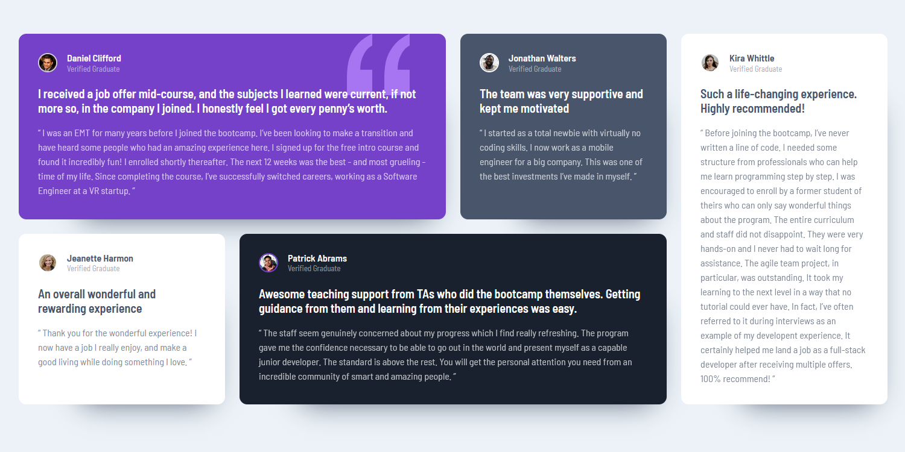

<h1 align="center">👥 Testimonial Section Grid</h1>
<p align="center">
  This is a solution to the <a href="https://www.frontendmentor.io/challenges/testimonials-grid-section-Nnw6J7Un7">Testimonials grid section</a> challenge on Frontend Mentor.
</p>
<h2 align="center">
	
</h2>
<p align="center">
  <a href="#tech">Technologies</a> •
  <a href="#objective">Objective</a> •
  <a href="#breakpoints">Breakpoints</a> •
  <a href="#use">How to Use</a> •
  <a href="#author">Author</a>
</p>

---

<h2 id="tech">🚀 Technologies </h2>

<a href="https://developer.mozilla.org/en-US/docs/Web/HTML" target="_blank">
  
</a>
<a href="https://developer.mozilla.org/en-US/docs/Web/CSS" target="_blank">
  
</a>


<h2 id="objective">🎯 Objective </h2>

<p>This project was built with the intent to practice the following subjects:</p>
<ul>
	<li>CSS custom properties</li>
	<li>CSS Grid</li>
	<li>Mobile-first workflow</li>
</ul>
<p>My main focus with this project was CSS Grid. In order to easily achieve different layout for various breakpoints I applied an <code>area-name</code> to each testimonial, so it was just a game of reorganize template area in each breakpoint.</p>

<p>Here are some examples:</p>

```css
@media (min-width: 33em) {
	.grid {
		grid-template-areas: 
			"one one"
			"two three"
			"five five"
			"four four";
	}
}

@media (min-width: 53em) {
	.grid {
		grid-template-areas: 
			"one one two"
			"five five five"
			"three four four";
	}
}
```

<h2 id="breakpoints">📱 Breakpoints</h2>


<h2 id="use">ℹ️ How to Use </h2>

Before cloning the repository into your machine you'll need: [Git](https://git-scm.com) and [NodeJS](https://nodejs.org/en/). Also it is good to have a code editor like [VSCode](https://code.visualstudio.com/).
```bash
#Clone this repository
$ git clone https://github.com/davyd-souza/testimonial-grid.git testimonial-grid

#Go into the repository
$ cd testimonial-grid

# Install dependencies with 
$ npm install # or
$ yarn

# Run app
$ npm start   # or
$ yarn dev
```


<h2 id="author">👤 Author </h2>

<p>
  Made with 💛 by Davyd Souza </br>
  <a href="https://www.linkedin.com/in/davyd-souza/" target="_blank" alt="LinnkedIn badge">
    
  </a>
  <a href="mailto:davyd.eduardo.souza@hotmail.com" target="_blank" alt="Outlook badge">
    
  </a>
  <a href="https://www.instagram.com/odeisouza/" target="_blank" alt="Instagram badge">
    
  </a>
</p>